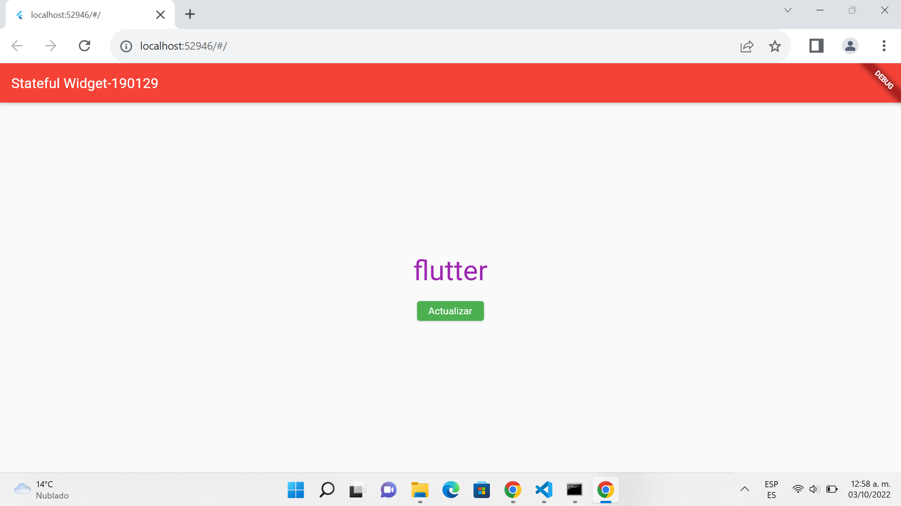
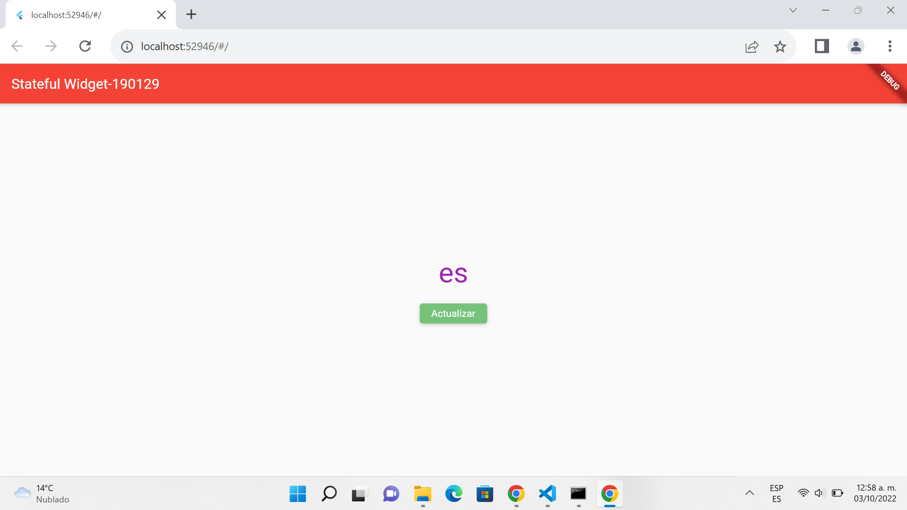

# Stateful Widget 
***
## Datos Escolares
Nombre: Eleazar Cortez Quirino
Docente: M.T.I. Marco Antonio Ramirez Hernàndez
Grado/Grupo: 10º "A"
Periodo: Septiembre-Diciembre
***
## Objetivo
El objetivo de este proyecto es implementar Stateful widgets, son los Widgets con estado o dinámicos, realizan el seguimiento de los cambios que se producen y pueden modificar la interfaz en función de estos cambios.
***
## Metodologia
Para poder lograr la implementacion de Staful widgets se realizo una investigacion de su comportamiento y el como se puede implementar a travez de trabajos escolares y laborales.

## Requerimientos:
-Flutter

-Visual Studio Code
***
## Visualizaciòn de la Pagina

***

***

***
## Elaborado por:
ING. Eleazar Cortez Quirino
***

